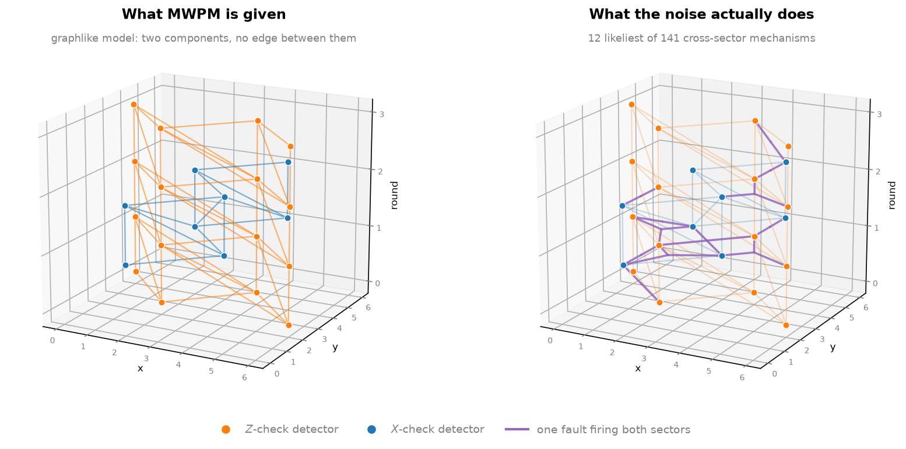
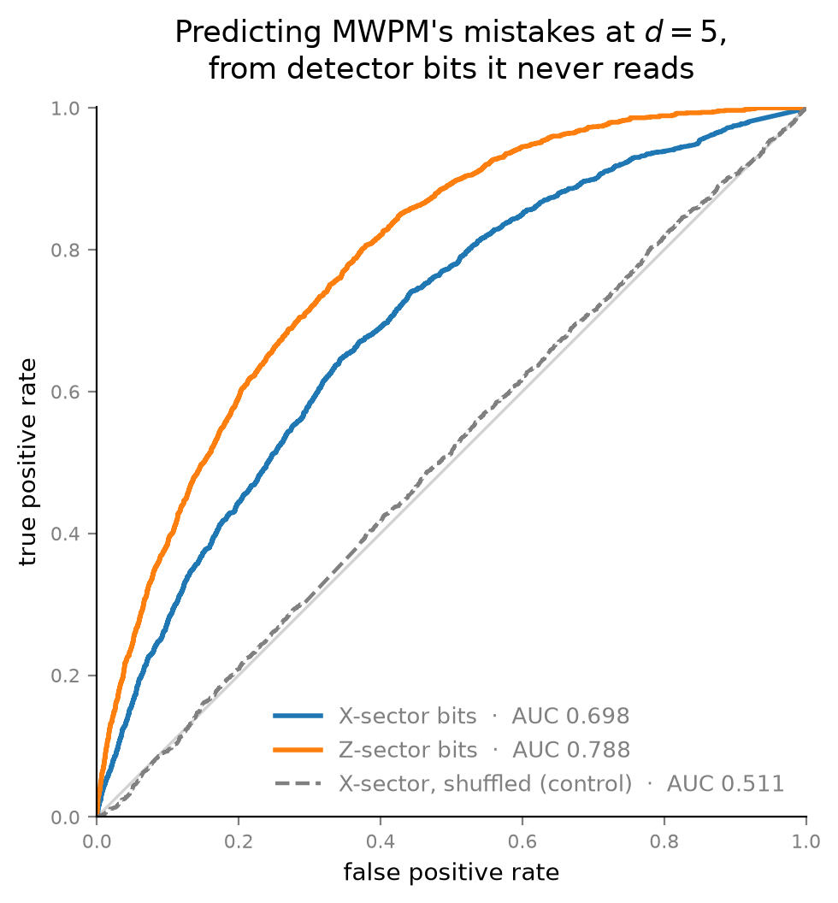

# Correlated errors and graph decoding

**Graphlike decomposition discards error correlations. How much does that cost
minimum-weight matching, and can a small learned decoder recover it?**

A rotated surface-code memory experiment produces detection events from two check
families. The standard decoder pipeline compiles the circuit's noise into a
*graphlike* error model — every fault mechanism forced into pieces touching at most
two detectors — because that is what matching consumes. Faults that fire both
families at once cannot survive that step intact.

This repository measures what gets lost, then tries to recover it.

## Status

| Notebook | Question |
| --- | --- | 
| [1 — Code and detectors](code_and_detectors.ipynb) | What does a decoder actually see? |
| 02 — Calibration noise and MWPM | Does realistic heterogeneity change the baseline? | 
| 03 — Correlated decoding | Can a small model recover what decomposition discarded? |

## What notebook 1 establishes

Uniform circuit-level noise at `p = 0.005`, logical-`Z` memory, `rounds = d`.
Every number below is in [`results/detector_model_facts.csv`](results/detector_model_facts.csv).

| | `d = 3` | `d = 5` |
| --- | ---: | ---: |
| Fault mechanisms in the true error model | 219 | 1,677 |
| ...that touch more than two detectors | 113 | 1,101 |
| ...that fire **both** check families | 141 | 1,175 |
| Share of error probability in those | **19.1%** | **23.9%** |
| Shots where an `X`-sector detector fires | 36.8% | **92.4%** |
| MWPM predictions changed by erasing every `X`-sector bit | **0 / 200,000** | **0 / 200,000** |
| AUC predicting MWPM's mistakes from `X`-sector bits alone | **0.699** | **0.698** |
| ...same features, shuffled (control) | 0.502 | 0.511 |

Four things follow, in order:

1. **A fifth of the error probability links the two check families.** `Y` errors and
   two-qubit depolarizing events on `CX` gates fire `X` and `Z` detectors together.
2. **Decomposition severs every one of them.** The graph handed to a matching decoder
   has literally two connected components — 16 `Z`-sector detectors and 8 `X`-sector
   detectors at `d = 3`, with no edge between them.
3. **So matching never reads half its input.** At `d = 5` an `X`-sector detector fires
   in 92% of shots, and erasing all of them changes zero of 200,000 predictions. This
   is correct behaviour given the input: no `X`-sector edge carries the observable.
4. **Those bits are not noise.** Logistic regression on the raw `X`-sector bits
   predicts *when MWPM is wrong* at AUC 0.70, against 0.50 for a shuffled control.

Point 4 is a lower bound, set by the least capable model available.

## Running it

These notebooks are written to run in a browser — Colab, Kaggle, anywhere with a
Python kernel. Nothing is assumed to be checked out locally and nothing needs
installing on your machine: the first cell `pip install`s `stim` and `pymatching`
and `curl`s `qec_utils.py` out of this repo. Open in Colab and run top to bottom,
about a minute.

`qec_utils.py` holds the rotated surface-code construction and the geometry plot,
because all three notebooks need them. Everything else — the fault injection, the
error-model parsing, the blinding and AUC experiments — is written in the notebook
that uses it, where you can read it.

## What this is not

- **No hardware run.** Simulation only. Notebook 02 uses a frozen IBM calibration
  snapshot as a source of realistic per-qubit error rates, not as a layout target:
  the heavy-hex lattice has degree 3 and rotated-code ancillas need degree 4, so this
  circuit does not run on that device without routing. That is asserted in the
  notebook rather than mentioned in a caveat.
- **No threshold estimate**, and no claim beyond the distances and noise settings tested.
- **No claim of a large win.** Correlated decoding is a known idea and published gains
  are modest — on the order of 10% in effective distance. Nothing measured here
  predicts more than that. It predicts something *measurable*, which is the point.
